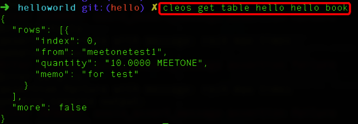
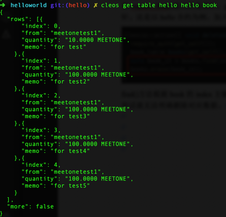
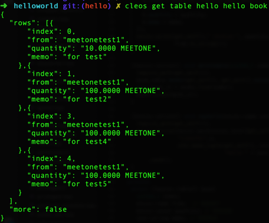
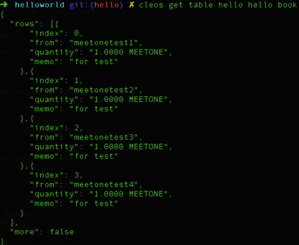
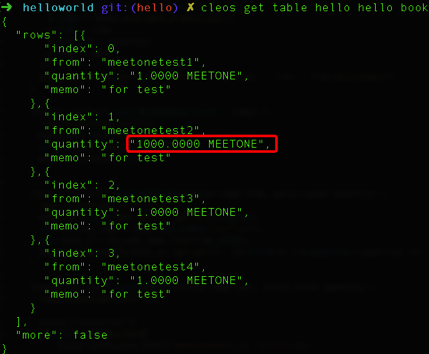

# 智能合约开发入门教程

## 目录
* [1 智能合约包含的文件](###1&#160;智能合约包含的文件)
  * [1.1 hpp文件](####1.1&#160;hpp文件)
  * [1.2 cpp文件](####1.2&#160;cpp文件)
  * [1.3 wasm 和 abi文件](#####1.3&#160;wasm和abi文件)
* [2 智能合约的部署](###2&#160;智能合约的部署)
* [3 智能合约的使用](###3&#160;智能合约的使用)
* [4 apply()函数](###4&#160;apply()函数)
* [5 合约中的权限](###5&#160;合约中的权限)
* [6 inline action](###6&#160;inline&#160;action)
* [7 数据的存储](###7&#160;数据的存储)
  * [7.1 增(emplace)](####7.1&#160;增（emplace）)
  * [7.2 查(find)](####7.2&#160;查（find))
  * [7.3 删(erase)](####7.3&#160;删（erase）)
  * [7.4 改(modify)](####7.4&#160;改（modify）)
  * [7.5 multi_index多索引](####7.5&#160;multi_index多索引)
  * [7.6 迭代器](####7.6&#160;迭代器)

## 1&#160;智能合约包含的文件

智能合约主要包含4个文件：`hpp`、`cpp`、`abi`、`wasm`，其中`abi`和`wasm`两个文件是由`eosio.cdt`编译工具生成，当然也可以自己编写`abi`。

### 1.1&#160;hpp文件

hpp文件包含cpp文件所引用的变量、常量、函数的声明。

### 1.2&#160;cpp文件

智能合约功能具体实现的源码。
惯例，首先来上手写个打印hello world的智能合约，初步了解下智能合约。在通常的编译器上，编写hello world都是主动输出的，但是合约不同，它主要强调了互动性，EOS里面定义为action，智能合约会根据action作出相应回应。

```c++
#include <eosiolib/eosio.hpp> //包含合约使用的一些声明

namespace meetone {
  //定义一个hello类，公有继承自系统合约
class[[eosio::contract]] hello : public eosio::contract {
 public:
  //使用命名空间
  using contract::contract;

  //定义一个名为sayhello的action，需要传入用户名
  [[eosio::action]] void sayhello(eosio::name user){
    //打印出 "Hello world! 用户名"，eosio::name{用户名}.to_string()是将eosio::name类型转为string类型
    eosio::print("Hello world!", eosio::name{user}.to_string());
  }
}
  //将特定action暴露给系统，这样其他账户也可以调用
EOSIO_DISPATCH(meetone::hello,(sayhello))
```
这里类名和合约账户名没有关系，但是为了方便管理，合约文件名、类名以及合约账户最好能一致。合约只有一个`sayhello`action，里面只有一句打印的语句，任何用户都可以调用该action，相应的合约会打印 `Hello world! 用户名` 作为回应。一个合约里面可以定义多个action，而且这些action还可以互相调用。

### 1.3&#160;wasm和abi文件

任何部署到EOS主网的智能合约都得编译为wasm格式，而abi(Application Binary Interface)则是可以让用户的action在JSON数据和二进制数据之间转换，通过abi实现使用者和智能合约之间的交互。
有了上面的hpp和cpp文件就可通过[eosio.cdt](https://github.com/EOSIO/eosio.cdt)正式编译合约了。
```
eosio-cpp -contract=${contract} -abigen ${contract}.cpp -o ${contract}.wasm
```
contract是智能合约名，-abigen会生成abi文件。执行完上述命令行后会同时生成wasm和abi文件。


这是hello智能合约生成的abi文件，在abi文件里已经声明了sayhello这个action。

## 2&#160;智能合约的部署

智能合约部署之前，需要为智能合约创建了一个对应账户。
[创建账户](https://developers.eos.io/eosio-cleos/reference#cleos-create-account)：
```
cleos create account eosio hello <owener-key> <active-key>
```
命令行中hello是用户部署智能合约的账户，有了账户就可以部署智能合约了，部署合约的账户需要有充足的CPU和RAM资源，以免部署失败：
```
cleos set contract hello ../hello -p hello
```

## 3&#160;智能合约的使用

部署好智能合约后，开发者或用户就可以使用该合约了，以下是`meetonetest1`账户调用`hello`智能合约的`sayhello`action：
```
cleos push action hello sayhello '["meetonetest1"]' -p meetonetest1
```
`hello`是智能合约账户名，`sayhello`是`hello`合约中的action，`meetonetest1`是action需要传入的参数，-p表示为该action提供权限的账户。
执行上述命令行结果：


`hello`合约的响应了`meetonetest1`用户的`sayhello`action操作，输出`Hello world!meetonetest1`。(开发人员需要注意的是：在EOS主网上面，print打印的消息是打印到打包的节点上，在本地是无法看到的)

## 4&#160;apply()函数

每个智能合约必须实现一个`apply()`函数，没错，是必须，那上面的hello合约为什么没有？其实hello合约并不是没有，因为在EOSIO_DISPATCH这个宏定义里已经实现了。
```c++
#define EOSIO_DISPATCH( TYPE, MEMBERS ) \
extern "C" { \
   void apply( uint64_t receiver, uint64_t code, uint64_t action ) { \
      if( code == receiver ) { \
         switch( action ) { \
            EOSIO_DISPATCH_HELPER( TYPE, MEMBERS ) \
         } \
         /* does not allow destructor of thiscontract to run: eosio_exit(0); */ \
      } \
   } \
} \
 /// @}  dispatcher
```
`apply()`接口函数会监听合约所有输入的aciton并做出相应动作，根据`recevier`、`code`和`action`执行特定操作，`code`也是个智能合约。接下来在`hello`合约基础上我们自己来写个`apply()`函数，具体功能是：给智能合约账户转MEETONE token，打印出转账结果。代码示例如下:
```c++
#include <eosiolib/asset.hpp>  //定义资产（数量和类别）
#include <eosiolib/eosio.hpp>

namespace meetone {
class[[eosio::contract]] hello: public eosio::contract {
 public:
  using contract::contract;
  void on_transfer(eosio::name from, eosio::name to, eosio::asset quantity,
                   std::string memo) {
    //防止合约被攻击
    if (get_self() == from || get_self() != to) {
      return;
    }
    //转账时打印消息
    eosio::print("receive ", quantity," from ", from.to_string());
  }

  [[eosio::action]] void sayhello(eosio::name user) {
    //打印出 "Hello world! 用户名"，eosio::name{用户名}.to_string()是将eosio::name类型转为string类型
    eosio::print("Hello world!",eosio::name{user}.to_string());
  }
};
}  // namespace meetone

//apply() 函数
extern "C" void apply(capi_name receiver, capi_name code, capi_name action) {
  if (code == receiver) {
    switch (action) {
      //合约中action的暴露
      EOSIO_DISPATCH_HELPER(meetone::hello,
                            (sayhello))
    }
    //使用eosiomeetone合约的transfer给hello合约转账时才会触发
  } else if (code == "eosiomeetone"_n.value && action == "transfer"_n.value)
  {
    eosio::datastream<const char*> ds =
        eosio::datastream<const char*>(nullptr, 0);
    //执行hello合约的on_transfer方法
    eosio::execute_action(eosio::name(receiver), eosio::name(code),
                          &meetone::hello::on_transfer);
  }
}
```
在`hello`类里面定义了一个`on_transfer`函数，参数结构和目前的代币转账方法参数一致，用于接受转账时候传入的参数，`on_transfer`不是一个action对外是不暴露的，只有合约本身才可以调用该函数。
```c++
if (get_self() == from || get_self() != to) {
  return;
}
```
这个是为了防止合约被攻击，避免transfer假通知。可以参考文章[《EOS 智能合约最佳安全开发指南》](https://github.com/slowmist/eos-smart-contract-security-best-practices)。合约开发人员需要在合约上线前完成攻击测试和基础安全防御的部署。
关键在于`apple()`函数，上面代码和`EOSIO_DISPATCH`相比多了`else if`的判断语句，当`apply`监听到有用户使用`eosiomeetone`合约的`tansfer`action给`hello`合约转账则会执行`hello`合约中的`on_transfer`方法。即使用其他合约的`tansfer`方法给hello合约转账，合约也不会有任何操作。`”eosiomeetone”_n`是将字符串`eosiomeetone`转成`eosio::name`类型，也可以写成`eosio::name{“eosiomeetone”}`。重新编译和部署hello合约测试：


`meetonetest1`用`eosiomeetone`的`transfer`action给`hello`合约转`100.0000 MEETONE`，此时会调用合约中`on_transfer`打印出红框内信息。


而如果`meetonetest1`用`eosiomoreone`的`transfer`action给`hello`合约转`1.0000 MORE`，则不会调用合约中的方法。

## 5&#160;合约中的权限

对于一些特定的action，不希望他人也可以操作，这时候就需要加入权限的校验。
```c++
[[eosio::action]] void sayhello(eosio::name user) {
  require_auth(get_self);
  //打印出 "Hello world!用户名"，eosio::name{用户名}.to_string()是将eosio::name类型转为string类型
  eosio::print("Hello world!", eosio::name{user}.to_string());
}
```
这里给`sayhello`加入`require_auth()`权限校验，`get_self()`指`hello`合约本身，因此执行`sayhello`时需要用到合约的`active`权限，才能执行该action。


当权限不是合约的权限时，系统会抛出异常提示缺少`hello`合约权限。也可以修改`require_auth(user)`则需要用户的权限。

## 6&#160;inline&#160;action

通过`inline action`可以在一个合约里面调用其他合约的action，也可以调用合约自身的其他action的。
还是以hello合约为例子，修改sayhello：
```c++
[[eosio::action]] void sayhello(eosio::name user, eosio::asset quantity) {
  require_auth(get_self());
  
  eosio::action(eosio::permission_level{get_self(), "active"_n},
                "eosiomeetone"_n, "transfer"_n,
                std::make_tuple(get_self(), user, quantity,
                                "hello " + user.to_string()))
      .send();
}
```
`action()`是一个`inline action`，`permission_level{}`里是调用这个`inline action`用到的权限，这里用到的是`get_self()`的active权限，也就是合约`hello`的active权限，需要说明的是，在`permission_level{}`中传入的账户需要被设置该合约的`eosio.code`权限才能使用该`inline action`，也就是说`hello`账户需要设置`hello@eosio.code`。再举个例子，如果`permission_leve{"meetonetest1"_n,"active"_n}`，则`meetonetest1`的active权限需要加入`hello@eosio.code`权限。具体操作命令如下：
```
cleos set account permission hello active '{"threshold": 1,"keys": [{"key": "EOS8F6KfcdpLgNXf5LpAx5yzhw8RfBce1E9UNdoi2HVvAWrsC6f3D{hello合约的actvie权限的公钥}","weight": 1}],"accounts": [{"permission":{"actor":"hello","permission":"eosio.code"},"weight":1}]}' owner -p hello
```
通过`cleos get account hello`可以查看`hello`账户的active权限已经加入了`hello@eosio.code`权限，这样就可以在正常使用inline action了。


`“eoisomeetone”_n`和`”transfer”_n`分别指调用的合约以及合约中的action.
```
std::make_tuple(get_self(), user, quantity, "hello " + user.to_string())
```
是给`transfer`传入的4个参数。最后通过`send()`将该action广播出去。重新编译部署上述合约来测试一下：


`sayhello`传入2个参数一个是`meetonetest1`账户名和`quantity`转账数量，`hello`实现在合约中调用了`eosiomeetone`transfer给`meetonetest1`转`1.0000 MEETONE`。

## 7&#160;数据的存储

智能合约执行结束后，所占用的内存会被释放。程序中的所有变量都会丢失，链上也不会有记录，因此合约要想持久记录有用的数据，就需要将数据存储到EOSIO数据库中。EOSIO是通过`eosio::multi_index`类来操作数据库。对数据操作主要的就是增、删、改、查种操作。
仍旧以前文中的hello合约为例：
```c++
struct [[eosio::table]] book {
  uint64_t index;
  eosio::name from;       // 转账用户
  eosio::asset quantity;  // 转账金额
  std::string memo;       // 转账留言

  uint64_t primary_key() const { return index; }  // 主键，每张表必须有主键
  //参数序列化，可有可无，加入的话可以提升编译速度
  EOSLIB_SERIALIZE(book, (index)(from)(quantity)(memo))
};
typedef eosio::multi_index<"book"_n, book> book_table;
```
首先需要定义一个转账记录账簿`book`的结构体，然后使用EOSIO数据库交互容器`multi_index`实例化该数据表，book是book_table的结构体。每张表都需要有一个主键，其类型必须是`uint64_t`。`multi_index`是一个线性的表，只有一列，每一行都只存储一个对象。`book`表中每条数据包含4个成员变量。需要说明的是，如果想增加或者修改表中的字段数据类型，需要清空数据表，否则会报错，开发者应该避免修改里面数据结构。
```c++
typedef eosio::multi_index<"book"_n, book> book_table;
```
上面是`multi_index`的实例化`book`表：`"book"_n`是我们存储数据的表名。通过命令行查表中数据时需要用到。

### 7.1&#160;增（emplace）

```c++
const_iterator emplace(name payer, Lambda&& constructor)
```
**参数**

- `payer`: 创建表的账户名；
- `constructor`：添加数据对象的lambda表达式。

**说明：**

在表中添加一条新的记录，增加新记录需要消耗payer的ram(现在payer无法指定其他账户只能是合约本身,指定其他账户时，合约会抛出异常)。

**例子：**

```c++
void on_transfer(eosio::name from,
                 eosio::name to,
                 eosio::asset quantity,
                 std::string memo) {
  if (get_self() == from || get_self() != to) {
    return;
  }
  book_table books(get_self(), get_self().value);
  books.emplace(get_self(), [&](auto& b) {
    b.index = books.available_primary_key();
    b.from = from;
    b.quantity = quantity;
    b.memo = memo;
  });
  eosio::print(get_self(), " receive ", quantity, " from ", from.to_string());
}
```
上述例子实现转账记录的存储，这里我们在前文`hello`合约的`on_transfer`方法加入数据插入操作，当监听到每一笔`MEETONE`交易时都会在`book`表中插入一条数据。
```c++
book_table books(get_self(), get_self().value);
```
上面是实例化`book`数据表，`book_table`是先前定义的`eosio::multi_index`，第一个`get_self()`是指创建该数据表的支付ram的账户为`hello`合约本身，`get_self().value`是查表的`scope`这里也是用到的合约本身，也可以用其他账户来作为scope）。
```c++
books.emplace(get_self(), [&](auto& b) {
  b.index = books.available_primary_key();
  b.from = from;
  b.quantity = quantity;
  b.memo = memo;
});
```
emplace是数据插入方法，`[&](auto& b){}`是一个`lambda`表达式，`available_primary_key()`是根据主键值自增。这样每转账一笔就会在`book`表中插入一条数据。


这里`meetonetest1`给`hello`合约转了`10.0000 MEETONE`，留言 `“for test”`，可通过以下命令行查询插入的数据情况:
```
cleos get table hello hello book
```
第一个hello是合约账户名，第二个hello是前文中提到的scope，book是表名。上面可以看到book表成功的增加一条记录。查询结果：



### 7.2&#160;查（find)

**find:** 通过主键查找数据表中已有记录

```c++
const_iterator find(uint64_t primary) const
```
**参数：**

- `primary`：需要查询对象的主键值

**说明：**

返回查询到的对象的迭代器，如果没有查询到指定对象则返回值指向end迭代器，查询不到指定对象无法放回错误信息。

**get：** 也是通过主键查找数据表中已有记录

```c++
const T& get(uint64_t primary, const char* error_msg = "unable to find key") const
```
**参数：**

- `primary`：需要查询的对象主键值
- `error_msg`: 查不到指定对象时候，返回的提示信息

**说明：**

返回查询到的对象而非迭代器，没有查询到指定对象时会返回error_msg的错误提示。其实通过源码可以看到get方法底下也是用通过findl来查找主键对象。
```c++
const T& get(uint64_t primary,
             const char* error_msg = "unable to find key") const {
  auto result = find(primary);
  eosio_assert(result != cend(), error_msg);
  return *result;
}
```

### 7.3&#160;删（erase）

**erase：** 根据主键删除主键对应对象
```c++
const_iterator erase(const_iterator itr)
```
**参数：**

- `itr`：待删除对象的迭代器
**说明：**

将`itr`迭代器指定的对象从表中删除，释放`payer`支付的`ram`。若待删除对象不存在、itr无效或者action没有权限修改数据表时会抛出异常。

**例子：**
```c++
[[eosio::action]] void deletedata(uint64_t index) {
  require_auth(get_self());
  book_table books(get_self(), get_self().value);
  auto book_it = books.find(index);
  //查找的主键对象不存在时，返回错误提示
  eosio_assert(book_it != books.end(),"not exist!")
  books.erase(book_it);
}
```
`find`方法根据`book`的`index`主键值进行查找对应对象的迭代器并返回，因此主键值如果不唯一的话就无法明确删除对应数据。在测试之前先在`book`表中先插入多条数据：



在`book`表中一共存储了5条数据，接下来会用命令行调用`deletedata`删除其中一条记录:
```
cleos push action hello deletedata '["2"]' -p hello
```
这里我们指定了删除主键`index`为2的数据，查表可以看到index为2的数据已经被删除:



### 7.4&#160;改（modify）

**modify：** 修改表中已存在的对象
```c++
void modify(const_iterator itr, name payer, Lambda&& updater)
```
**参数：**

- `itr`：待修改对象的迭代器
- `payer`：更新表的支付ram的账户名，为0时表示更新数据的payer和创建时的payer相同
- `updater`：修改数据对象的lambda表达式

**说明：**

更新`itr`迭代器指定对象的内容，`payer`支付消耗的`ram`，`payer`与现有的`payer`不同时，会原路退还现有`payer`之前支付的`ram`。

**例子：** 在hello合约中加入action modifydata:
```c++
[[eosio::action]] void modifydata(eosio::name from, eosio::asset quantity) {
  require_auth(get_self());
  book_table books(get_self(), get_self().value);
  auto book_it = books.find(index);
  by_user_name.modify(book_it, get_self(),
                      [&](auto& b) { b.quantity = quantity; });
}
```
通过命令行调用`modifydata`action修改table表对应index的quantity值：
```
cleos push action hello modifydata '["0","1000.0000 MEETONE"]' -p hello
```


这里我们修改`index`为`0`的`quantity`为`1000.0000 MEETONE`，执行成功后可以看到数据已成功修改。

### 7.5&#160;multi_index多索引

有的时候可能因为业务需求，一种索引方式可能无法满足需求，这时候需要添加多级索引。
相对一级索引的类型只能是uint64_t，二级索引最多可以支持16个，而且二级索引类型不局限于uint64_t，支持的类型有：i64、i128、i256、ripemd168以及sha256。
在前文中`book`表中加入二级索引的定义如下：
```c++
struct [[eosio::table]] book {
  uint64_t index;
  eosio::name from;       // 转账用户
  eosio::asset quantity;  // 转账金额
  std::string memo;       // 转账留言

  uint64_t primary_key() const { return index; }  // 主键，每张表必须有主键
  uint64_t by_user_name() const { return from.value; }  // 以from用户名为二级索引
  //参数序列化，可有可无，加入的话可以提升编译速度
  EOSLIB_SERIALIZE(book, (index)(from)(quantity)(memo))
};
typedef eosio::multi_index<"book"_n, book,
                          eosio::indexed_by< "user"_n, eosio::const_mem_fun<book, uint64_t,
                          &book::by_user_name>>> book_table;
```
**参数：**

- `indexed_by`：实例化multi_index表二级索引
- `“user”_n`：二级索引名称
- `const_mem_fun`：函数调用运算符
- `uint64_t`：二级索引数据类型
- `&book::by_user_name`：通过book结构体中的by_user_name函数获得索引

**例子：**

增加索引方式之前，如果table表中已经有数据，则之后添加的数据才能被索引到，之前的数据不能被新增的索引方式检索到。这里我们先使用上一节的`deletedate`action删除数据表中所有数据，再重新添加4条记录，from来自不同账户：



```c++
[[eosio::action]] void modifydata(eosio::name from, eosio::asset quantity) {
  require_auth(get_self());
  book_table books(get_self(), get_self().value);
  //实例化二级索引表
  auto by_user_name = books.get_index<"user"_n>();
  //根据二级索引表查找相应from账户名的数据
  auto book_it = by_user_name.find(from.value);
  //修改改条数据的quantity值
  by_user_name.modify(book_it, get_self(),
                      [&](auto& b) { b.quantity = quantity; });
}
```
修改前文中的`modifydata`，通过`from`用户名来查找数据，`get_index`用于获取二级索引实例化的表，二级索引使用的是用户名因此`find`需要输入的是`from`用户名的`uint64_t`类型。通过查找用户名然后修改`quantity`的值。
```
cleos push action hello modifydata '["meetonetest2","1000.0000 MEETONE"]' -p hello
```



成功修改`from`为`meetonetest2`记录的`quantity`值。

### 7.6&#160;迭代器

- `begin & cbegin：`返回对象表中指向最低主键值的迭代器
- `end & cend：`返回对象表中指向最高主键值的迭代器
- `rbegin & crbegin：`返回一个反向迭代器，指向对象表中最高主键值
- `rend & crend：`返回对象表中指向最低主键的迭代器
- `lower_bound：`查找大于或等于给定主键值的最低主键对象
- `upper_bound：`查找小于或等于给定主键值的最高主键对象
